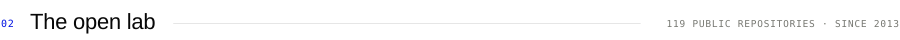

<!--
  Generated by scripts/build.tsx — do not edit by hand.
  Every block below is a React component rendered to a self-contained,
  animated SVG (fonts inlined, SMIL animations, no JavaScript), once for
  GitHub's light theme and once for dark. Edit src/ and run `bun run all`.
-->
<div align="center">

<a href="https://zhy0216.github.io"><picture><source media="(prefers-color-scheme: dark)" srcset="./assets/dark/header.svg"></picture></a>
<a href="https://zhy0216.github.io/work/"><picture><source media="(prefers-color-scheme: dark)" srcset="./assets/dark/divider-work.svg"></picture></a>
<a href="https://zhy0216.github.io/work/zebra/"><picture><source media="(prefers-color-scheme: dark)" srcset="./assets/dark/work-zebra.svg"></picture></a> <a href="https://zhy0216.github.io/work/starwreck/"><picture><source media="(prefers-color-scheme: dark)" srcset="./assets/dark/work-starwreck.svg"></picture></a>
<a href="https://zhy0216.github.io/work/better-trigger/"><picture><source media="(prefers-color-scheme: dark)" srcset="./assets/dark/work-better-trigger.svg"></picture></a> <a href="https://zhy0216.github.io/work/sangota/"><picture><source media="(prefers-color-scheme: dark)" srcset="./assets/dark/work-sangota.svg"></picture></a>
<a href="https://github.com/zhy0216?tab=repositories"><picture><source media="(prefers-color-scheme: dark)" srcset="./assets/dark/divider-lab.svg"></picture></a>
<a href="https://github.com/zhy0216?tab=repositories"><picture><source media="(prefers-color-scheme: dark)" srcset="./assets/dark/lab.svg"></picture></a>
<a href="https://zhy0216.github.io/blog/"><picture><source media="(prefers-color-scheme: dark)" srcset="./assets/dark/divider-notes.svg"></picture></a>
<a href="https://zhy0216.github.io/blog/?post=css-z-index-is-a-tree"><picture><source media="(prefers-color-scheme: dark)" srcset="./assets/dark/note-1.svg"></picture></a>
<a href="https://zhy0216.github.io/blog/?post=postgresql-speculative-insertion"><picture><source media="(prefers-color-scheme: dark)" srcset="./assets/dark/note-2.svg"></picture></a>
<a href="https://www.linkedin.com/in/im-yang/"><picture><source media="(prefers-color-scheme: dark)" srcset="./assets/dark/footer.svg"></picture></a>

</div>

<p align="center">
  <a href="https://zhy0216.github.io">zhy0216.github.io</a> &nbsp;·&nbsp;
  <a href="https://zhy0216.github.io/blog/">Field notes</a> &nbsp;·&nbsp;
  <a href="https://www.linkedin.com/in/im-yang/">LinkedIn</a> &nbsp;·&nbsp;
  <a href="https://github.com/zhy0216?tab=repositories">All repositories</a>
</p>

<details>
<summary>How this page is built</summary>

Every block above is a React component rendered to a static, self-contained SVG: fonts are inlined, motion is SMIL, and there is no JavaScript, so it animates inside GitHub's `` sandbox. Each block is rendered twice and served through `<picture>`, so it follows your GitHub colour mode.

```sh
bun install
bun run fetch    # GitHub GraphQL → data/github.json (GITHUB_TOKEN or a logged-in gh CLI)
bun run build    # src/ → assets/{light,dark}/*.svg + this README
bun run preview  # preview/light.html + preview/dark.html, as GitHub renders them
```

A GitHub Action re-runs the pipeline every day so the calendar, the counters and the notes stay current. Snapshot: 2026-09-05.

</details>
